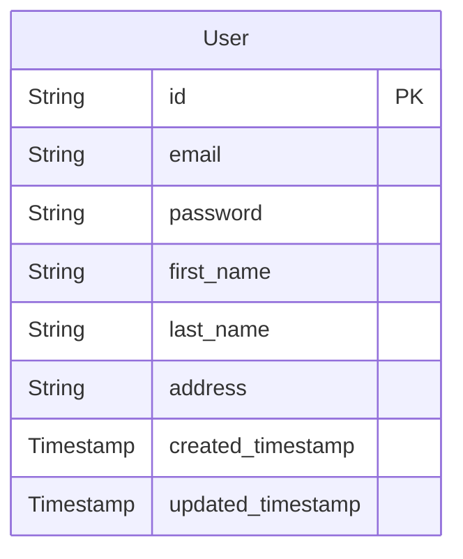
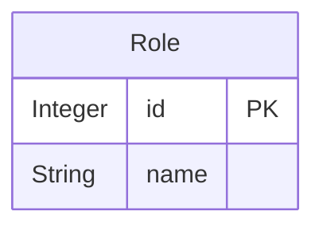
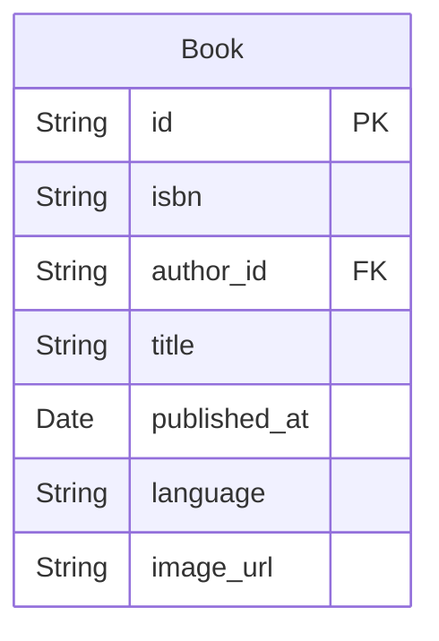
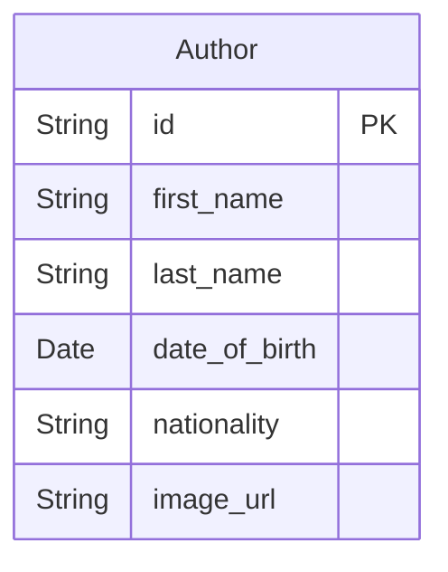
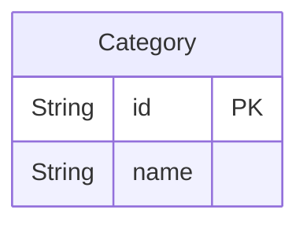
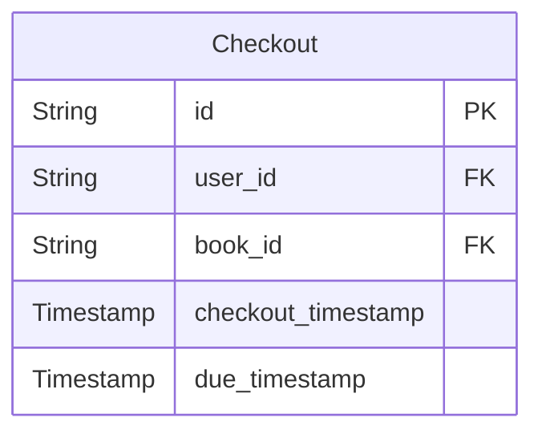
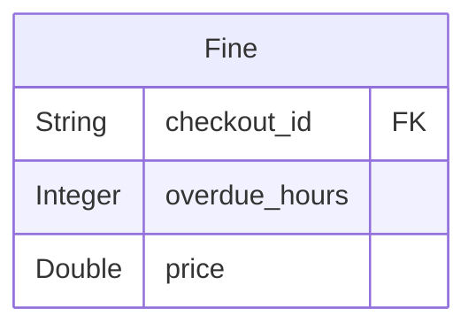
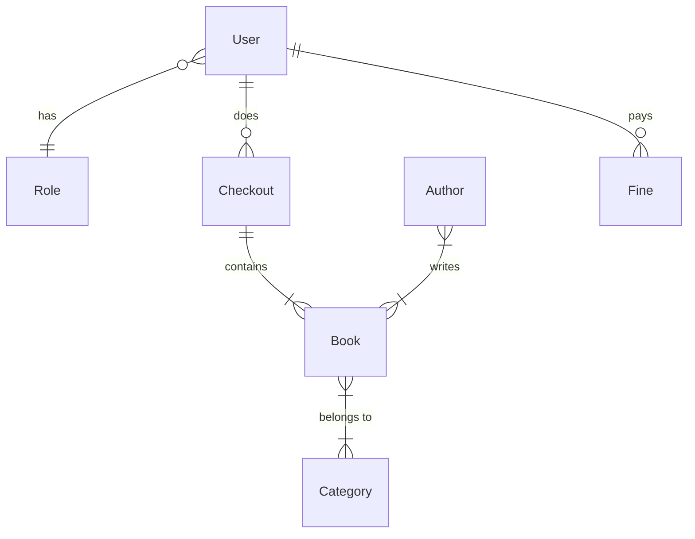

# PRJ301 Assignment: Library Management Web Application

by Ho Anh Dung - HE181529

Preview: <!-- TODO: Preview URL of the app running in production -->

## Table of contents

- [1. Introduction](#1-introduction)
- [2. Features](#2-features)
  - [2.1. User features](#21-user-features)
  - [2.2. Admin features](#22-admin-features)
- [3. Prequisites](#3-prequisites)
- [4. How to run](#4-how-to-run)
  - [4.1. Run the application locally](#41-run-the-application-locally)
  - [4.2. Run the application in a container](#42-run-the-application-in-a-container)
- [5. Folder structure](#5-folder-structure)
- [6. Database design](#6-database-design)
  - [6.1. Entities](#61-entities)
  - [6.2. Relationships](#62-relationships)

## 1. Introduction

This is a web application for managing a library. It allows users to search for books, check out books, and pay fines. It also allows administrators to manage books, authors, categories, and users.

This web application is built with:

- [Java 17](https://www.oracle.com/java/technologies/javase/jdk17-archive-downloads.html)
- [Spring](https://spring.io/) (as the web framework) & Spring Boot
- [Maven](https://maven.apache.org/) (as the project management tool)
- [Microsoft SQL Server](https://www.microsoft.com/en-us/sql-server/sql-server-downloads) (as the database management system)
- [Docker](https://www.docker.com/) (to run the application, and database in a seperated environment, i.e. container)
- JSP (Jakarta Server Page, as the view technology)
- JSTL (Jakarta Standard Tag Library, to simplify the JSP code)

This is a project for the Assignment 1 of PRJ301 (Java Web Application Development) course at FPT University.

## 2. Features

### 2.1. User features

- Search for books (by category, title, author, or ISBN)
- View book details
- Manage checkouts, and checked-out books
- Pay fines (if overdue)

### 2.2. Admin features

- Manage all books, authors, categories, and users
- Manage all checkouts, and fines

## 3. Prequisites

- [Java 17](https://www.oracle.com/java/technologies/javase/jdk17-archive-downloads.html)
- [Maven](https://maven.apache.org/download.cgi)
- [Microsoft SQL Server](https://www.microsoft.com/en-us/sql-server/sql-server-downloads) (if running the application locally)
- [Docker](https://www.docker.com/products/docker-desktop) (if running the application in a container)

## 4. How to run

### 4.1. Run the application locally

<!-- TODO: 1. Edit env variables in `application.properties` -->
<!-- TODO: 2. Setup database -->
<!-- TODO: 3. Run `mvn spring-boot:run` -->

### 4.2. Run the application in a container

<!-- TODO: Same steps as 4.1 but env variables are in `Dockerfile` instead -->

## 5. Folder structure

## 6. Database design

### 6.1. Entities

- `User` entity:

---

- `Role` entity:

---

- `Book` entity:

---

- `Author` entity:

---

- `Category` entity:

---

- `Checkout` entity:

---

- `Fine` entity:

---

### 6.2. Relationships

