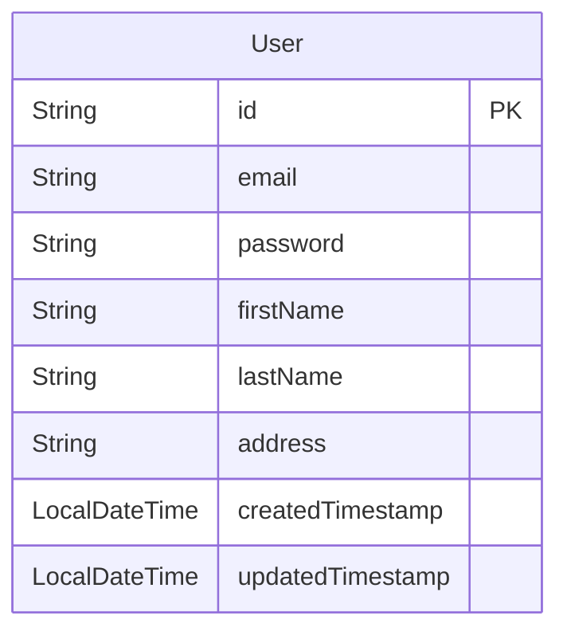
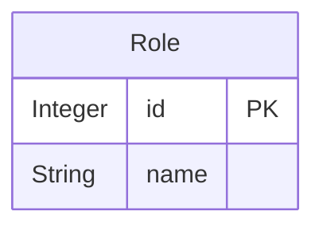
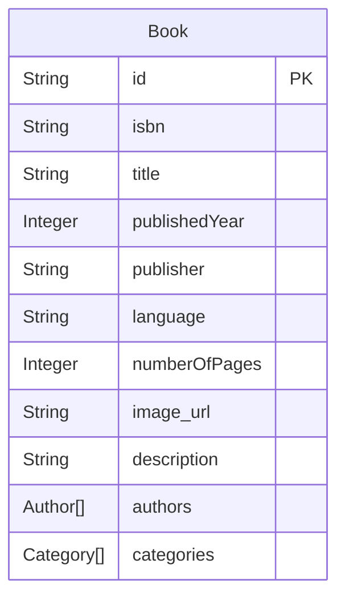
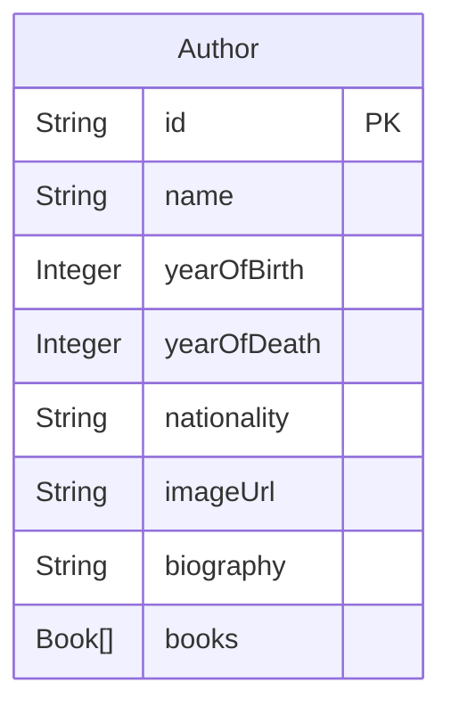
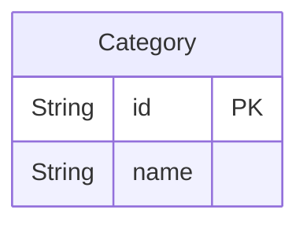
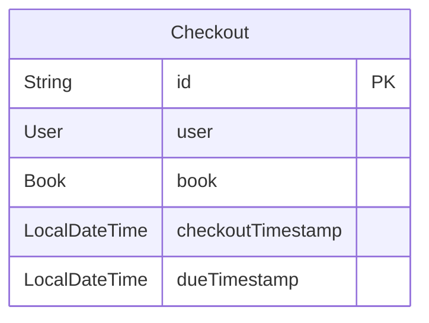
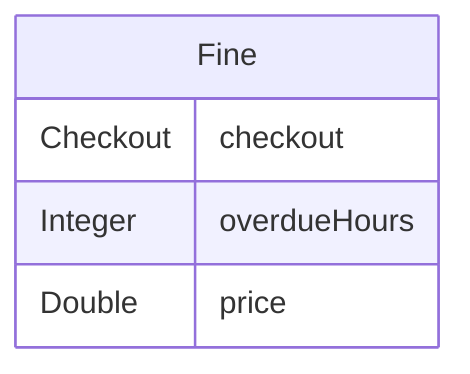
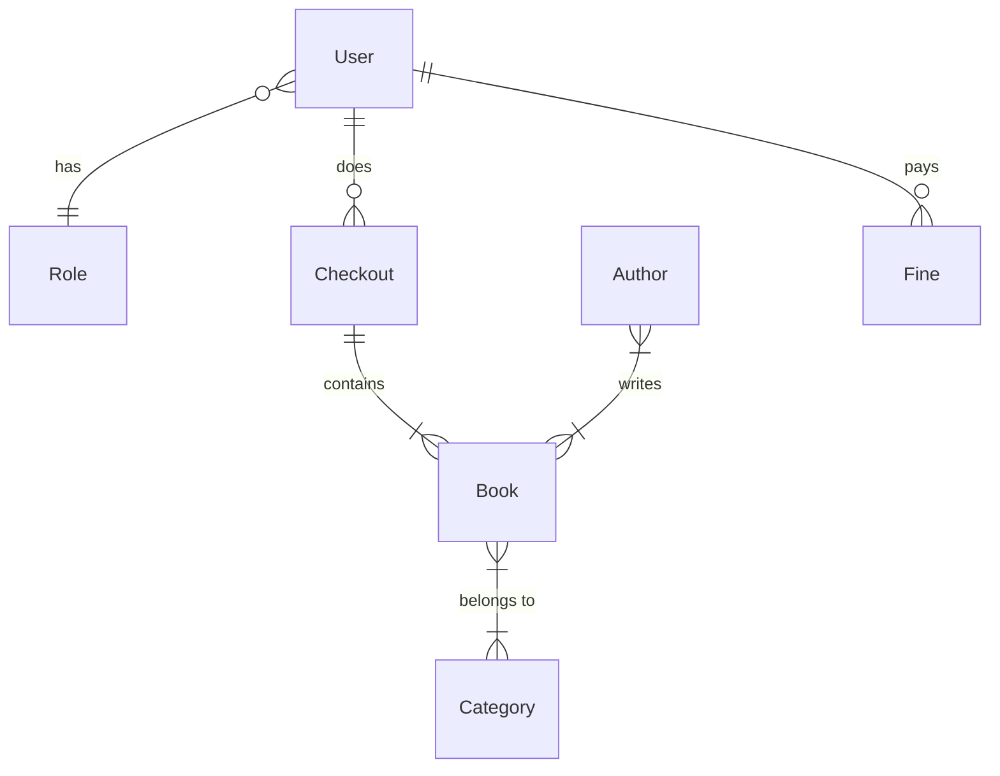

# Books Maison Web Application

<p align="center">
    
</p>

_by Ho Anh Dung - HE181529_

Preview URL: https://books-maison.live

## Table of contents

1. [Introduction](#1-introduction)
2. [Features](#2-features)
3. [How to run the app locally](#3-how-to-run-the-app-locally)
4. [Folder structure](#4-folder-structure)
5. [Database design](#5-database-design)
   1. [Entities](#5.1-entities)
   2. [Relationships](#5.2-relationships)

## 1. Introduction

This is a web application for managing a library. It allows users to search for books, check out books, and pay fines. It also allows administrators to manage books, authors, categories, and users.

This web application is built with:

- [Java 17](https://www.oracle.com/java/technologies/javase/jdk17-archive-downloads.html)
- [Spring](https://spring.io/): the web framework and its tools:
  - [Spring Boot](https://spring.io/projects/spring-boot): Scaffolding, running and building Spring application easily
  - [Spring Security](https://spring.io/projects/spring-security): Authentication, authorization and access-control framework
- [Maven](https://maven.apache.org/): the project management tool
- [Azure SQL database](https://www.microsoft.com/en-us/sql-server/sql-server-downloads): the cloud-based version of SQL Server
- JSP (Jakarta Server Page, as the view technology)
- JSTL (Jakarta Standard Tag Library, to simplify the JSP code)
- [Heroku](): to deploy this web app to the cloud

The purpose of this project for the Assignment 1 of PRJ301 (Java Web Application Development) course at FPT University.

## 2. Features

### 2.1. User features

- Search for books (by category, title, author, or ISBN)
- View book details
- Manage checkouts, and checked-out books
- Show their fines (for overdue checkouts)

### 2.2. Admin features (future feature)

- Manage all books, authors, categories, and users
- Manage all checkouts, and fines

## 3. How to run the app locally

1. Clone this repository

```cmd
git clone https://github.com/dung204/books_maison.git
```

2. Create file named `application.properties` under `src/main/resources`, copy & paste the content from `application-example.properties`.

3. Edit the database URL, username, password

4. Open the terminal and run:

```cmd
mvn spring-boot:run
```

or run this if you don't have Maven installed:

For MacOS/Linux:

```sh
./mvnw spring-boot:run
```

For Windows:

```cmd
.\mvnw.cmd spring-boot:run
```

## 4. Folder structure

```
├── .mvn/ - Maven wrapper
├── src/ - Source code
│   ├── main
│   │   ├── java - Java code
│   │   │   └── com
│   │   │      └── books_maison
│   │   ├── resources - Project resources
│   │   │   ├── application-example.properties - Example environment variables file
│   │   │   ├── data.sql - SQL script to insert initial data
│   │   └── webapp - The frontend code
│   │       ├── WEB-INF
│   │       ├── jsp - JSP files
│   │       ├── styles - CSS files
│   │       └── images - Image files
│   └── test
├── target/ - Build artifacts
├── .gitignore - Ignoring some files/folders for git
├── mvnw - Maven portable for MacOS/Linux
├── mvnw.cmd - Maven portable for Windows
├── pom.xml - Project properties file
├── README.md - This document
```

Inside `src/main/java/com/books_maison`, each entity is a package. The structure of each entity package (take `User` as an example) is:

```
├── user - name of the entity
│   ├── dto - Data Transfer Object
│   │   ├── CreateUserDTO.java - a DTO class contains fields for creating a user
│   │   ├── UpdateUserDTO.java - a DTO class contains fields for updating a user
│   ├── entity - Entity classes
│   │   ├── User.java - the entity class
│   ├── UserController.java - the controller class
│   ├── UserService.java - the service class
│   ├── UserRepository.java - the repository class
```

## 5. Database design

### 5.1. Entities

- `User` entity:



---

- `Role` entity:



---

- `Book` entity:



---

- `Author` entity:



---

- `Category` entity:



---

- `Checkout` entity:



---

- `Fine` entity:



---

### 5.2. Relationships


